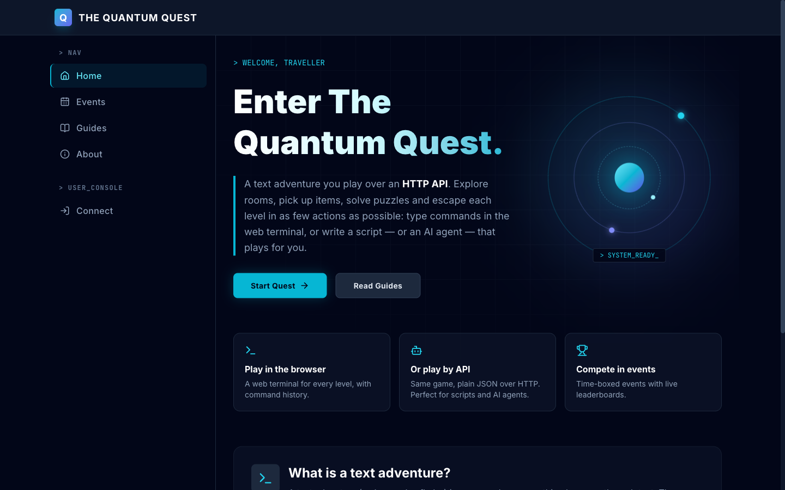

# The Quantum Quest

Open workshop material for learning agentic AI. The playground is a text adventure you play over HTTP: in the browser, with `curl`, with a script, or with an AI agent you build.



## What it is

A ready-to-run workshop for developers who know HTTP and JSON. No machine learning background needed. Participants go through three steps, each built on the one before:

1. **Play by hand**: in the browser, then with `curl`. Learn the API, the rules and the score.
2. **LLM as coding assistant**: have an LLM write a client or a bot from the OpenAPI spec.
3. **LLM as agent**: give an agent the game as tools, let it play, then improve it using its score.

Each game mechanic teaches one agent engineering lesson:

| In the game | The lesson |
|---|---|
| `/openapi.json` | Tool definitions: a tool is a contract (name, description, parameters) |
| Error messages are hints | Actionable errors make agents better |
| Par and counted actions | Every tool call has a cost: measure efficiency |
| `429` and `X-RateLimit-Remaining` | Retries and backoff |
| "Never put the key in the prompt" | Secrets stay out of the context |
| Event leaderboards | Objective evaluation: compare prompts, models and tool descriptions on the same level |

Formats: 2 hours (the three steps on the demo levels), half a day (more time on the agent), or a hackathon (teams iterate on their agent against an event leaderboard).

## Inspiration

The Quantum Quest is inspired by [The Temple of the Forgotten Prompt](https://adventure.wietsevenema.eu/), a text adventure for humans and AI agents created by [Wietse Venema](https://github.com/wietsevenema), which I played at "AI Agents : Live + Labs Paris", a Google Cloud event. Quest is an independent, open-source implementation (engine, levels, platform) that keeps the same game commands (`look`, `examine`, `move`, `take`, `drop`, `use`, `inventory`). I built it to run my own workshops: self-hosted on your own Google Cloud project, with your own levels, in English or French.

## Run a workshop

1. Get an instance: deploy your own ([docs/DEPLOY.md](docs/DEPLOY.md)) or run it locally (below).
2. Sign in as an admin, create an **event** covering the session, and pick its levels.
3. Share the site address. Participants start with the **Workshop** guides on the site ([`content/guides/`](content/guides)).
4. Run the session with the facilitator guide: [docs/WORKSHOP.md](docs/WORKSHOP.md) (agenda, hints, pitfalls, debrief).
5. Reference solutions for the facilitator: [`examples/`](examples) (a tiny Node.js client and a Python agent).

## Play

```bash
curl -H "Authorization: ApiKey $QUEST_KEY" https://<your-instance>/game/look
```

Sign in, start a level from **Level Select**, get an API key from **API Access**, then explore with `look`, `move`, `take`, `use`… The game API is described in [`apps/api/openapi.json`](apps/api/openapi.json) (also served at `/openapi.json`).

## Run it locally

Requires Node 24+.

```bash
npm install
cp apps/api/.env.example apps/api/.env   # in-memory store, dev login, no Google Cloud needed
npm run dev                              # API on :8080, web app on http://localhost:5173
```

Log in with any name on the login page (dev login). Logging in as "Admin" (`admin@dev.local`) gives the admin role.

To use a real Firestore locally, start the emulator (needs Java 21+) and set `STORE=firestore` in `.env`:

```bash
gcloud emulators firestore start --host-port=localhost:8681
# .env: STORE=firestore  FIRESTORE_EMULATOR_HOST=localhost:8681  GOOGLE_CLOUD_PROJECT=demo-quest  SEED_DEMO=true
```

## Commands

| | |
|---|---|
| `npm test` | Engine, demo levels and API tests (add `FIRESTORE_EMULATOR_HOST=…` to also test the Firestore store) |
| `npm run typecheck` | TypeScript across all packages |
| `npm run build` | Web app to `apps/web/dist`, API bundle to `apps/api/dist` |
| `npm run levels:push -- <files> [--publish] [--dry-run]` | Validate and upload levels (see [docs/LEVELS.md](docs/LEVELS.md)) |
| `docker build -t quest .` | Production image |
| `node --test examples/client-node/*.test.mjs`, `pytest examples/agent-adk-python` | Reference solution tests (see [examples/](examples)) |

## Docs

- [Running a workshop](docs/WORKSHOP.md): facilitator guide
- [Reference solutions](examples): client and agent examples, for facilitators
- [Architecture](docs/ARCHITECTURE.md): components, decisions, data model, security
- [Deploying to Google Cloud](docs/DEPLOY.md): Cloud Run, Firestore, OAuth apps, GitHub Actions
- [Writing levels](docs/LEVELS.md)
- Starter guides: [`content/guides/`](content/guides) (markdown, `<slug>.md` in English and `<slug>.fr.md` in French, added to the site at startup when missing)

## Licence

[MIT](LICENSE)
